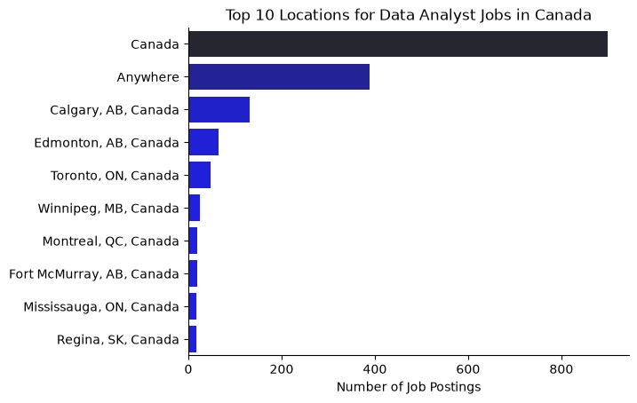
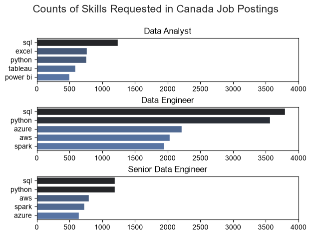
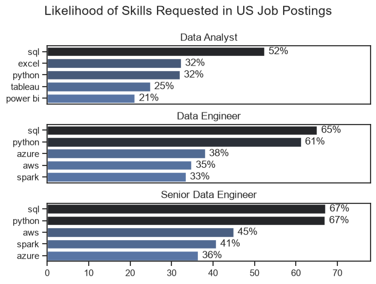
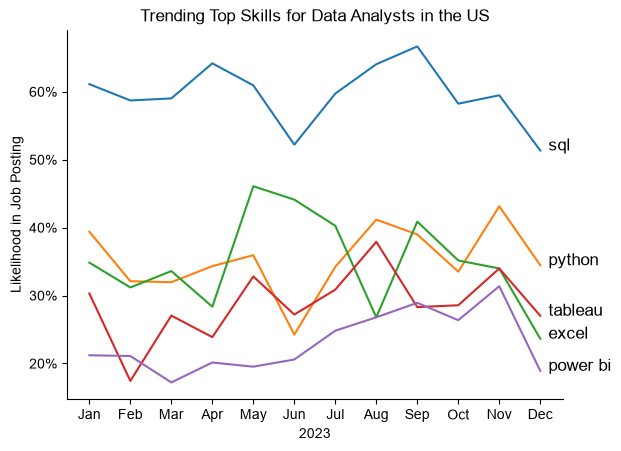
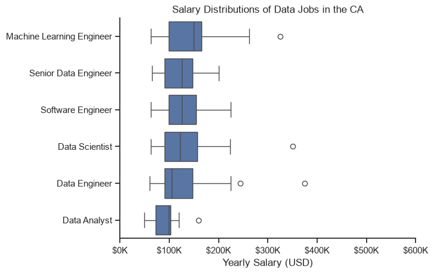
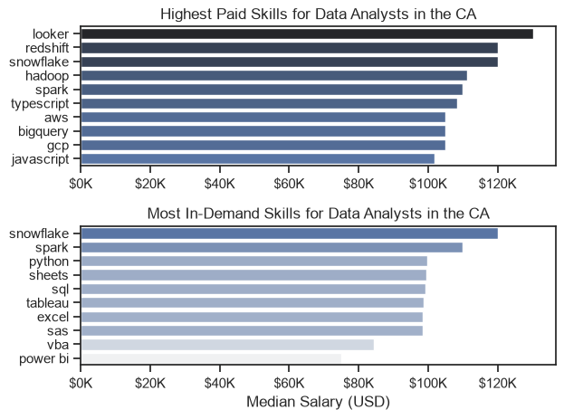

# Canadian Data Job Market Analysis

## Project Overview
This project provides a comprehensive evaluation of the Canadian data job market. By analyzing job postings, skill requirements, and salary trends, this analysis helps identify high-demand skill sets and their corresponding financial impact.

## Analysis Methodology
- **Data Source:** [lukebarousse/data_jobs](https://huggingface.co/datasets/lukebarousse/data_jobs)
- **Cleaning:** Standardized date formats and parsed JSON-like skill strings into actionable lists.
- **Filtering:** Focused on Canadian-based roles with a primary emphasis on Data Analyst positions.
- **Visualization:** Utilized `seaborn` and `matplotlib` to map market distribution, skill demand, and salary premiums.

## Visualizations

### 1. Market Distribution
*Overview of the top locations for data professionals across Canada.*



### 2. Skill Demand
*Comparison of absolute demand vs. relative likelihood of skills in job postings.*





### 3. Trending Skills
*Tracking the evolution of top-demand skills throughout the year.*



### 4. Compensation Analysis
*Salary distributions for top data roles and the premium paid for specific technical skills.*





---

## Technical Stack
- **Language:** Python
- **Data Manipulation:** `pandas`, `ast`
- **Visualization:** `seaborn`, `matplotlib`
- **Dataset Access:** `datasets` (Hugging Face)

## How to Reproduce
1. **Clone the repository:**
```bash
   git clone https://github.com/joeguy57/data_analytics.git